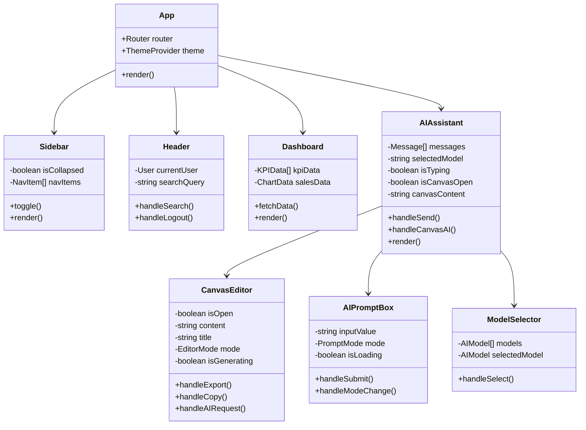

# Lovale 电商系统 - UML 详细设计文档

> 版本: 1.0.0  
> 更新日期: 2024-12-19

---

## 1. 类图 (Class Diagrams)

### 1.1 前端核心组件类图

### 1.2 后端模型类图

### 1.3 服务层类图

---

## 2. 序列图 (Sequence Diagrams)

### 2.1 用户登录序列图

### 2.2 AI 对话序列图

### 2.3 创建订单序列图

### 2.4 画布文档生成序列图

---

## 3. 活动图 (Activity Diagrams)

### 3.1 订单状态流转活动图

### 3.2 AI 助手模式切换活动图

---

## 4. 组件图 (Component Diagrams)

### 4.1 系统组件图

---

## 5. 部署图 (Deployment Diagram)

---

## 6. 数据流图 (Data Flow Diagrams)

### 6.1 系统数据流图

---

## 附录: 图表说明

| 图表类型 | 用途 | 工具 |
|---------|------|------|
| 类图 | 展示系统中类的结构和关系 | Mermaid |
| 序列图 | 展示对象之间的交互顺序 | Mermaid |
| 活动图 | 展示工作流程和状态转换 | Mermaid |
| 组件图 | 展示系统组件及其依赖 | Mermaid |
| 部署图 | 展示系统的物理部署架构 | Mermaid |
| 数据流图 | 展示数据在系统中的流动 | Mermaid |

---

*文档生成时间: 2024-12-19*
