# Lovale 电商后台管理系统 - 技术架构文档

> 版本: 1.0.0  
> 更新日期: 2024-12-19

---

## 目录

1. [系统概述](#1-系统概述)
2. [整体架构图](#2-整体架构图)
3. [技术栈](#3-技术栈)
4. [前端架构](#4-前端架构)
5. [后端架构](#5-后端架构)
6. [数据库设计](#6-数据库设计)
7. [AI 助手模块](#7-ai-助手模块)
8. [核心业务流程](#8-核心业务流程)
9. [部署架构](#9-部署架构)
10. [安全架构](#10-安全架构)

---

## 1. 系统概述

Lovale 是一个现代化的电商后台管理系统，采用前后端分离架构，集成 AI 智能助手，提供产品管理、订单处理、客户管理、数据分析等核心功能。

### 1.1 系统目标

- 提供直观易用的电商后台管理界面
- 实现实时数据分析和可视化
- 集成 AI 助手提升运营效率
- 支持多种 AI 模型切换
- 确保系统安全性和可扩展性

---

## 2. 整体架构图

### 2.1 系统架构总览

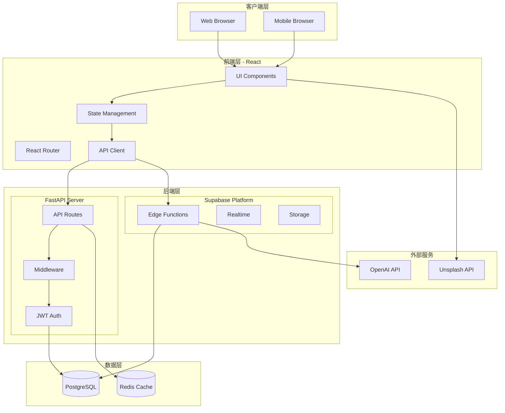

### 2.2 分层架构

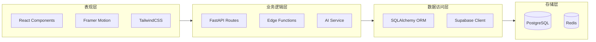

---

## 3. 技术栈

### 3.1 技术选型

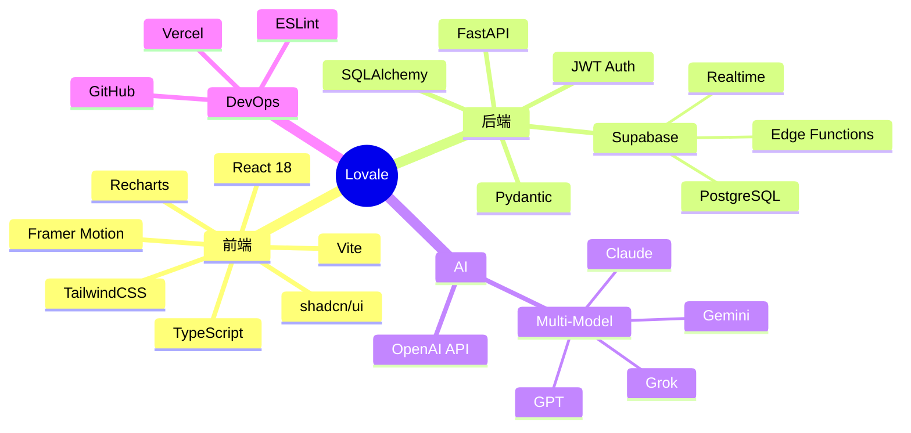

### 3.2 技术栈对比

| 层级 | 技术 | 选型原因 |
|------|------|----------|
| 前端框架 | React 18 | 组件化、生态丰富、性能优秀 |
| 类型系统 | TypeScript | 类型安全、开发体验好 |
| 构建工具 | Vite | 快速热更新、ESM 原生支持 |
| 样式方案 | TailwindCSS | 原子化 CSS、开发效率高 |
| 动画库 | Framer Motion | 声明式动画、流畅体验 |
| 后端框架 | FastAPI | 高性能、自动文档、类型支持 |
| ORM | SQLAlchemy 2.0 | 异步支持、成熟稳定 |
| 数据库 | PostgreSQL | 可靠性高、功能丰富 |
| BaaS | Supabase | 实时订阅、Edge Functions |
| AI | OpenAI API | 多模型支持、响应质量高 |

---

## 4. 前端架构

### 4.1 组件架构

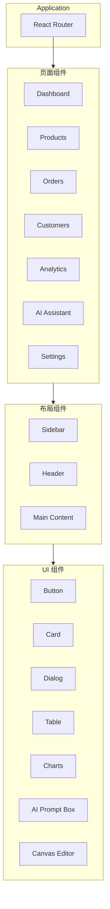

### 4.2 状态管理

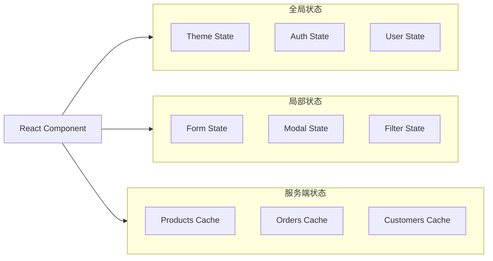

### 4.3 前端目录结构

```
frontend/src/
├── components/           # 可复用组件
│   ├── ui/              # 基础 UI 组件
│   │   ├── button.tsx
│   │   ├── card.tsx
│   │   ├── dialog.tsx
│   │   ├── ai-prompt-box.tsx
│   │   ├── canvas-editor.tsx
│   │   └── model-selector.tsx
│   ├── charts/          # 图表组件
│   │   └── kpi-card.tsx
│   └── layout/          # 布局组件
│       ├── sidebar.tsx
│       └── header.tsx
├── features/            # 功能模块
│   ├── dashboard/       # 仪表盘
│   ├── products/        # 产品管理
│   ├── orders/          # 订单管理
│   ├── customers/       # 客户管理
│   ├── analytics/       # 数据分析
│   ├── ai-assistant/    # AI 助手
│   └── settings/        # 系统设置
├── lib/                 # 工具函数
│   └── utils.ts
├── styles/              # 样式
│   └── tokens/          # Design Tokens
├── App.tsx              # 应用入口
└── main.tsx             # 渲染入口
```

---

## 5. 后端架构

### 5.1 FastAPI 架构

```mermaid
graph TD
    subgraph Request["请求处理"]
        Client[Client Request]
        CORS[CORS Middleware]
        Security[Security Headers]
        RateLimit[Rate Limiter]
    end

    subgraph Routing["路由层"]
        Health[/health]
        Auth[/auth]
        Products[/products]
        Orders[/orders]
        Customers[/customers]
        Dashboard[/dashboard]
        AI[/ai]
    end

    subgraph Service["服务层"]
        AuthService[Auth Service]
        ProductService[Product Service]
        OrderService[Order Service]
        AIService[AI Service]
    end

    subgraph Data["数据层"]
        ORM[SQLAlchemy]
        Cache[Redis]
        External[External APIs]
    end

    Client --> CORS
    CORS --> Security
    Security --> RateLimit
    RateLimit --> Routing
    Routing --> Service
    Service --> Data
```

### 5.2 API 路由设计

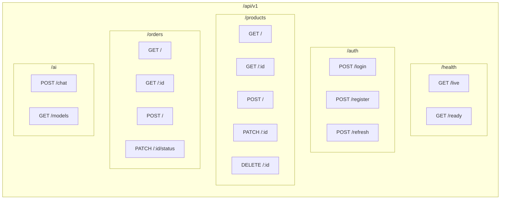

### 5.3 后端目录结构

```
backend/app/
├── api/                 # API 路由
│   ├── __init__.py     # 路由聚合
│   └── routes/         # 各功能路由
│       ├── health.py
│       ├── auth.py
│       ├── products.py
│       ├── orders.py
│       ├── customers.py
│       ├── dashboard.py
│       └── ai.py
├── core/               # 核心配置
│   ├── config.py      # 应用配置
│   ├── database.py    # 数据库连接
│   └── security.py    # 安全工具
├── models/            # SQLAlchemy 模型
│   ├── user.py
│   ├── product.py
│   ├── order.py
│   └── customer.py
├── schemas/           # Pydantic 模式
│   ├── user.py
│   ├── product.py
│   └── order.py
├── middleware/        # 中间件
│   ├── security.py   # OWASP 安全头
│   └── rate_limiter.py
└── main.py           # 应用入口
```

---

## 6. 数据库设计

### 6.1 ER 图

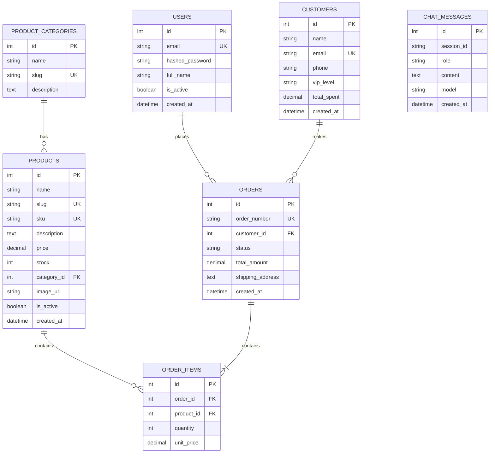

### 6.2 数据表说明

| 表名 | 描述 | 主要字段 |
|------|------|----------|
| `users` | 系统用户 | email, password, role |
| `customers` | 客户信息 | name, email, vip_level |
| `products` | 产品信息 | name, sku, price, stock |
| `product_categories` | 产品分类 | name, slug |
| `orders` | 订单记录 | order_number, status, total |
| `order_items` | 订单项 | product_id, quantity, price |
| `chat_messages` | AI 聊天记录 | session_id, role, content |

---

## 7. AI 助手模块

### 7.1 AI 助手架构

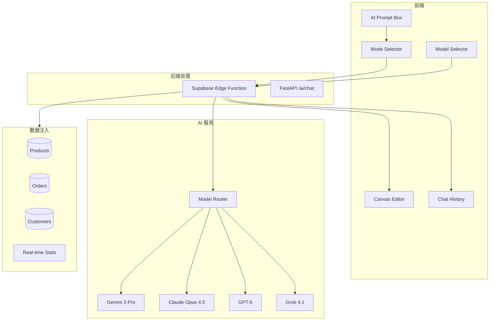

### 7.2 AI 对话模式

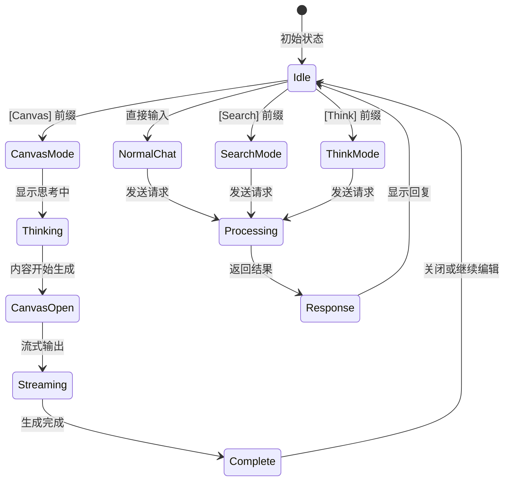

### 7.3 AI 请求流程

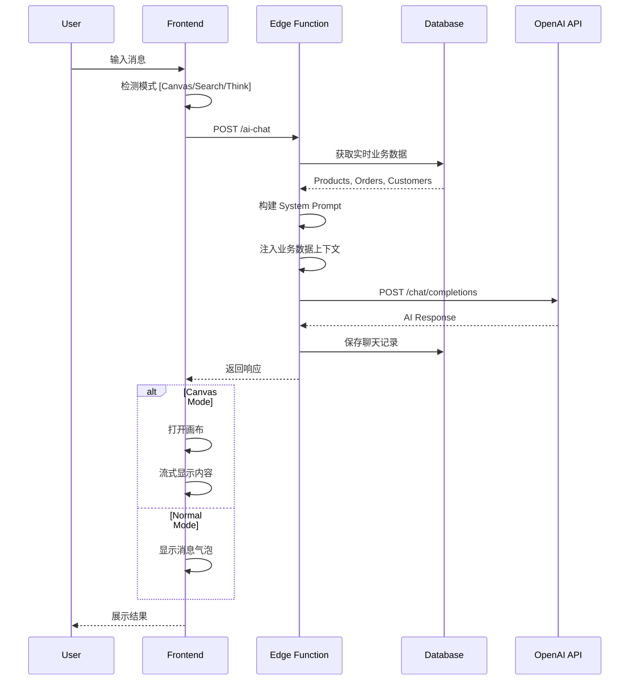

### 7.4 画布编辑器类图

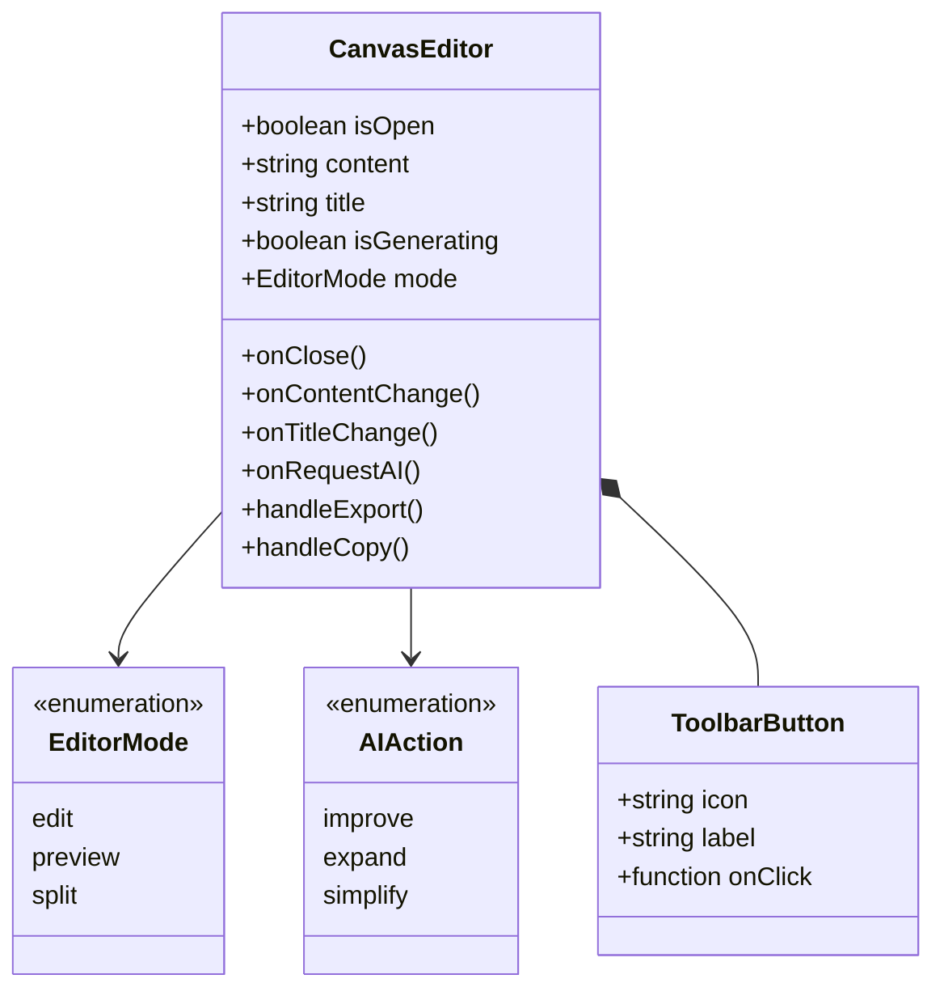

---

## 8. 核心业务流程

### 8.1 用户认证流程

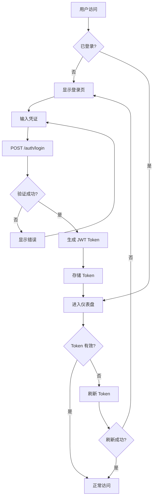

### 8.2 订单处理流程

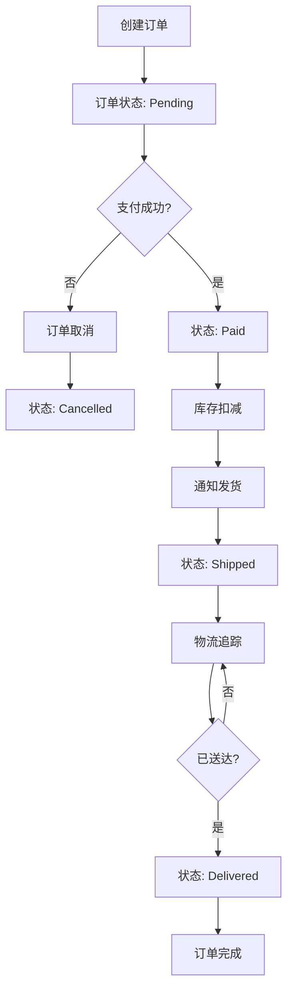

### 8.3 产品管理流程

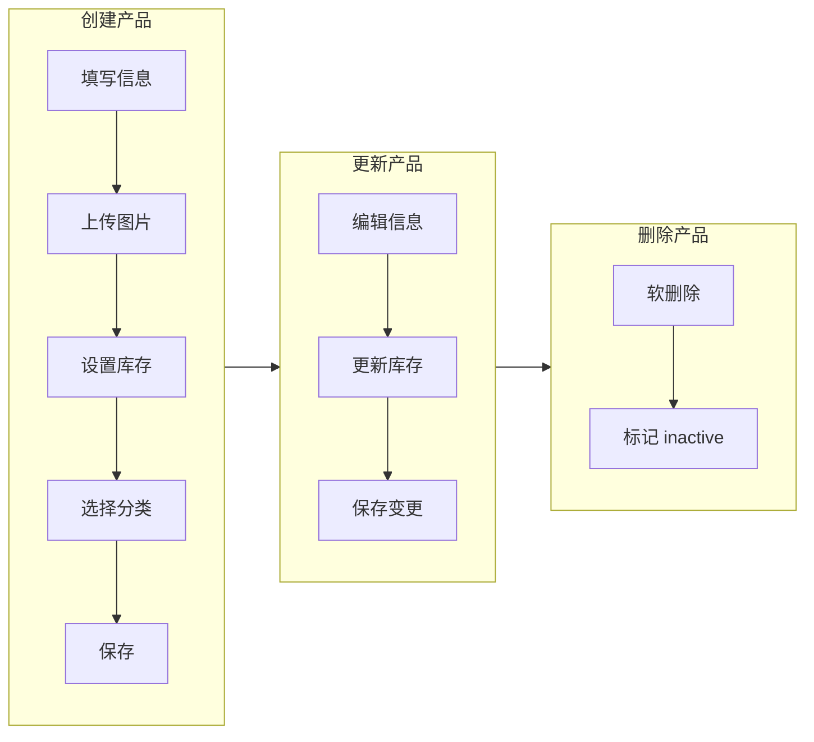

---

## 9. 部署架构

### 9.1 部署拓扑

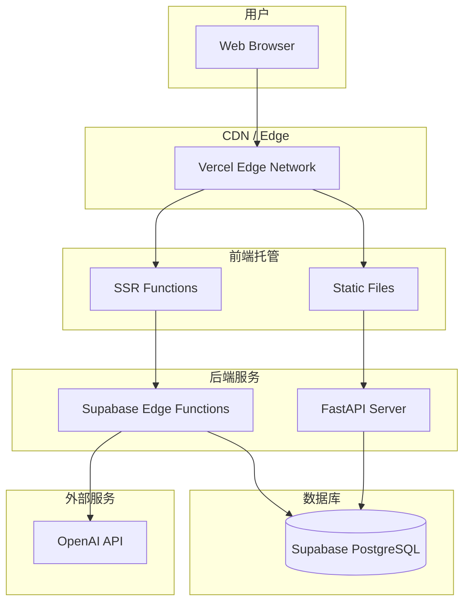

### 9.2 CI/CD 流程

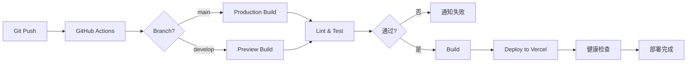

---

## 10. 安全架构

### 10.1 安全层级

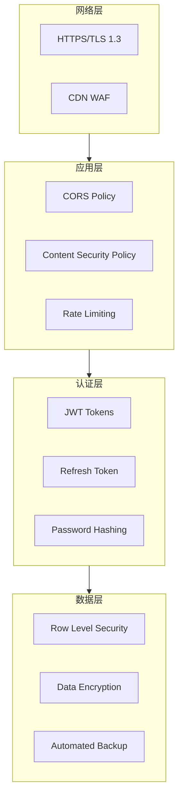

### 10.2 安全措施

| 层级 | 措施 | 说明 |
|------|------|------|
| 传输层 | HTTPS | TLS 1.3 加密传输 |
| 应用层 | CORS | 跨域资源共享策略 |
| 应用层 | CSP | 内容安全策略 |
| 应用层 | Rate Limiting | 滑动窗口限流 |
| 认证层 | JWT | 无状态身份验证 |
| 认证层 | bcrypt | 密码哈希 |
| 数据层 | RLS | 行级安全策略 |
| 数据层 | 加密存储 | 敏感数据加密 |

### 10.3 OWASP 安全头

```python
# Security Headers Middleware
headers = {
    "X-Content-Type-Options": "nosniff",
    "X-Frame-Options": "DENY",
    "X-XSS-Protection": "1; mode=block",
    "Strict-Transport-Security": "max-age=31536000; includeSubDomains",
    "Content-Security-Policy": "default-src 'self'",
    "Referrer-Policy": "strict-origin-when-cross-origin"
}
```

---

## 附录

### A. 环境变量配置

```env
# Frontend
VITE_SUPABASE_URL=https://xxx.supabase.co
VITE_SUPABASE_ANON_KEY=xxx

# Backend
DATABASE_URL=postgresql+asyncpg://...
OPENAI_API_KEY=sk-xxx
OPENAI_BASE_URL=https://api.openai.com/v1
SECRET_KEY=xxx
```

### B. 开发环境要求

- Node.js >= 18.0
- Python >= 3.11
- PostgreSQL >= 15
- Redis >= 7.0

### C. 相关文档

- [React 文档](https://react.dev)
- [FastAPI 文档](https://fastapi.tiangolo.com)
- [Supabase 文档](https://supabase.com/docs)
- [TailwindCSS 文档](https://tailwindcss.com/docs)

---

*文档生成时间: 2024-12-19*
