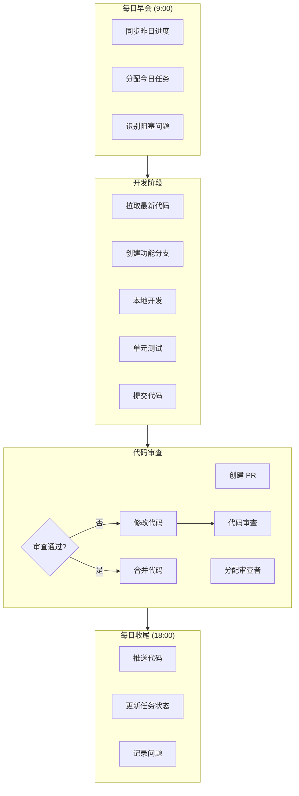
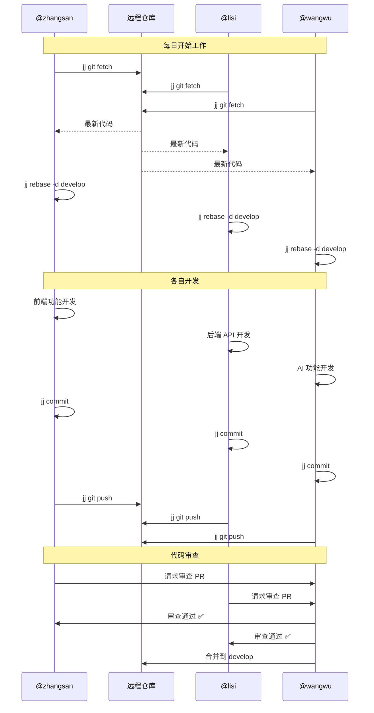
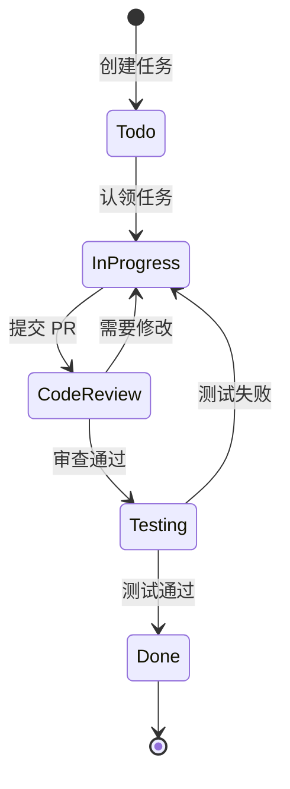
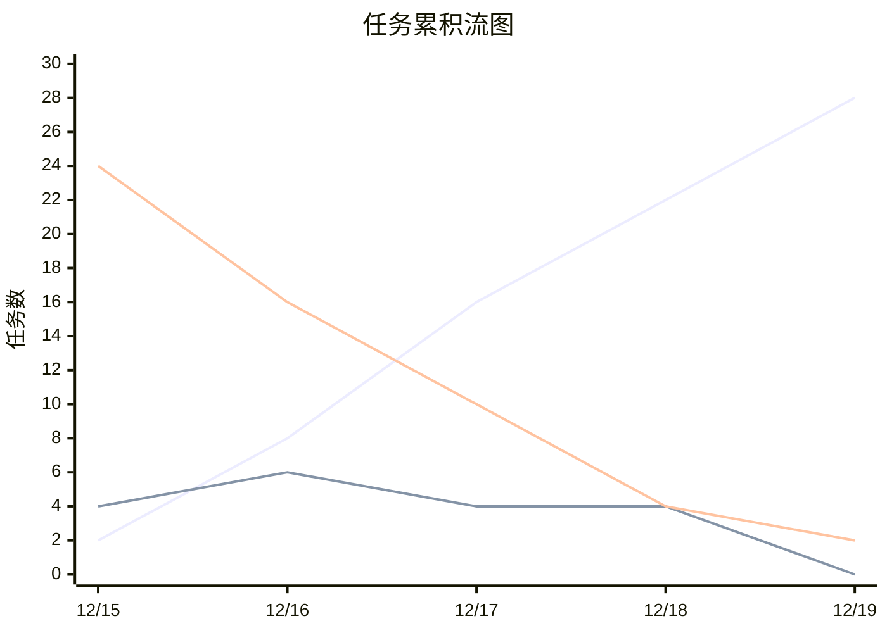
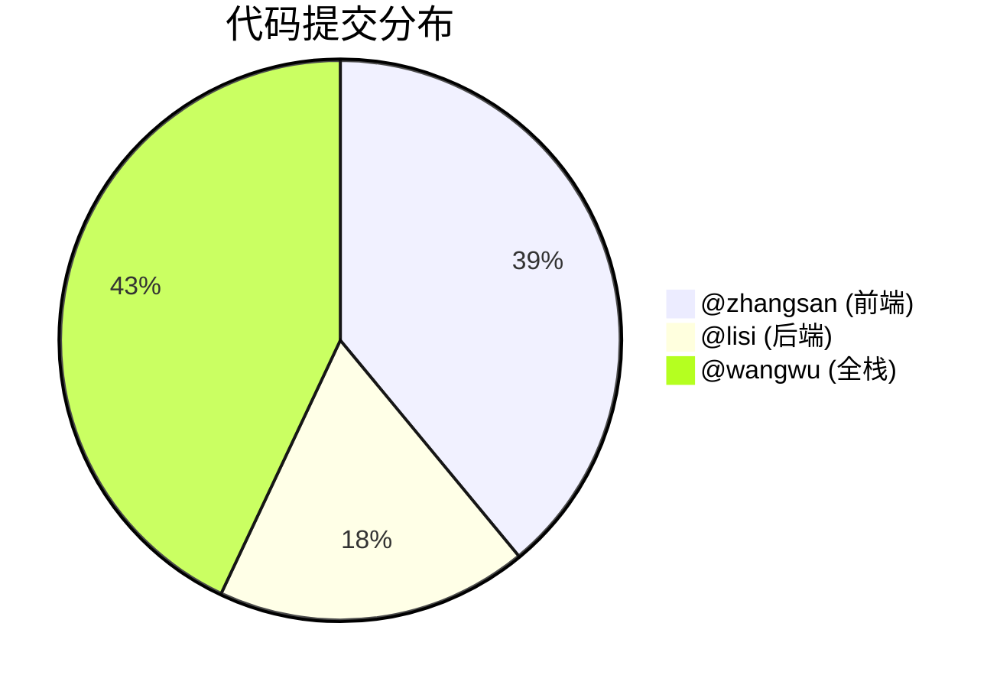
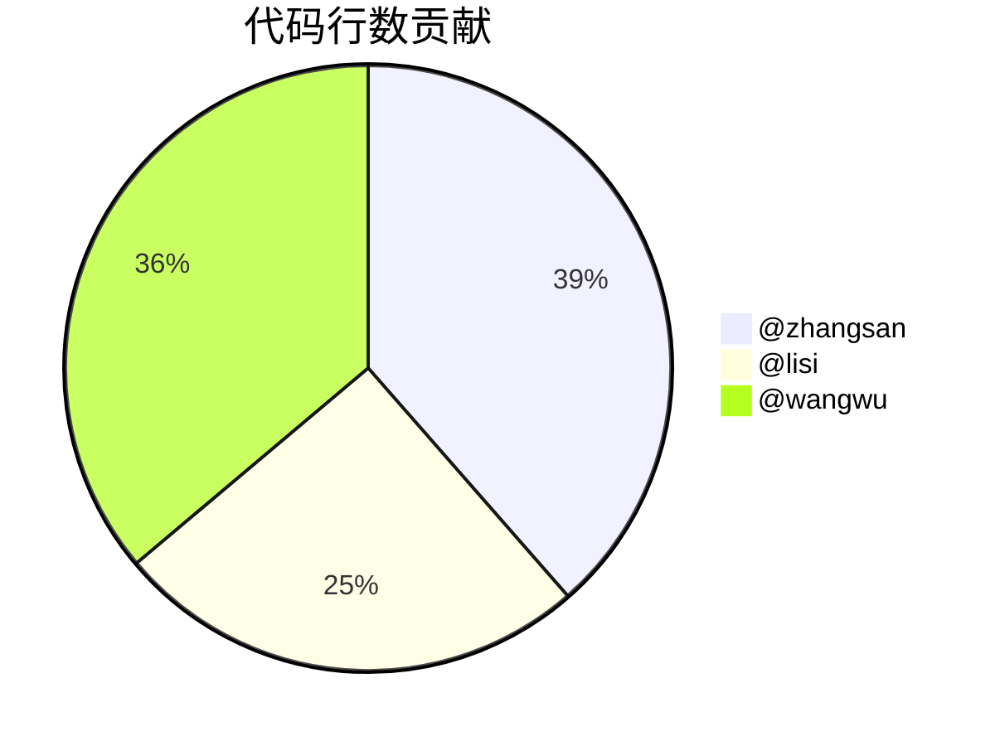

# Lovale 团队协作工作流文档

> **团队规模**: 3人  
> **开发周期**: 2024-12-01 ~ 2024-12-19  
> **版本控制**: Jujutsu (jj)

---

## 1. 团队成员与分工

### 1.1 团队结构

```
┌─────────────────────────────────────────────────────────────┐
│                      项目团队结构                            │
├─────────────────────────────────────────────────────────────┤
│                                                             │
│                    ┌──────────────┐                         │
│                    │   @wangwu    │                         │
│                    │  Tech Lead   │                         │
│                    │  全栈 + AI   │                         │
│                    └──────┬───────┘                         │
│                           │                                 │
│              ┌────────────┴────────────┐                    │
│              │                         │                    │
│       ┌──────┴──────┐          ┌───────┴─────┐              │
│       │  @zhangsan  │          │    @lisi    │              │
│       │  前端开发   │          │  后端开发   │              │
│       │  UI/UX     │          │  API/DB     │              │
│       └─────────────┘          └─────────────┘              │
│                                                             │
└─────────────────────────────────────────────────────────────┘
```

### 1.2 职责矩阵 (RACI)

| 任务领域 | @wangwu | @zhangsan | @lisi |
|---------|---------|-----------|-------|
| 项目规划 | **R/A** | C | C |
| 前端架构 | A | **R** | I |
| UI 组件开发 | C | **R/A** | I |
| 后端架构 | A | I | **R** |
| API 开发 | C | I | **R/A** |
| 数据库设计 | A | I | **R** |
| AI 功能 | **R/A** | C | C |
| 部署运维 | **R/A** | I | C |
| 文档编写 | **R** | C | C |

> R=负责执行, A=负责审批, C=需要咨询, I=需要通知

### 1.3 成员技能矩阵

```mermaid
radar
    title 团队技能雷达图
```

| 技能 | @wangwu | @zhangsan | @lisi |
|------|---------|-----------|-------|
| React/TypeScript | ⭐⭐⭐⭐ | ⭐⭐⭐⭐⭐ | ⭐⭐ |
| TailwindCSS | ⭐⭐⭐ | ⭐⭐⭐⭐⭐ | ⭐⭐ |
| FastAPI/Python | ⭐⭐⭐⭐ | ⭐⭐ | ⭐⭐⭐⭐⭐ |
| PostgreSQL | ⭐⭐⭐⭐ | ⭐⭐ | ⭐⭐⭐⭐⭐ |
| AI/LLM 集成 | ⭐⭐⭐⭐⭐ | ⭐⭐⭐ | ⭐⭐⭐ |
| DevOps | ⭐⭐⭐⭐⭐ | ⭐⭐ | ⭐⭐⭐ |

---

## 2. 开发工作流

### 2.1 日常开发流程



### 2.2 分支协作模型

```
main (生产环境)
│
├── develop (开发环境)
│   │
│   ├── feature/frontend-ui (@zhangsan)
│   │   ├── sidebar-component
│   │   ├── dashboard-kpi
│   │   └── product-management
│   │
│   ├── feature/backend-api (@lisi)
│   │   ├── auth-routes
│   │   ├── product-crud
│   │   └── order-management
│   │
│   └── feature/ai-assistant (@wangwu)
│       ├── multi-model-support
│       ├── canvas-editor
│       └── real-api-integration
│
└── release/v1.0.0
```

### 2.3 代码同步流程



---

## 3. 沟通协作

### 3.1 沟通渠道

| 渠道 | 用途 | 响应时间 |
|------|------|----------|
| 微信群 | 日常沟通、快速问答 | < 30分钟 |
| 腾讯会议 | 每日站会、技术讨论 | 实时 |
| GitHub Issues | 任务跟踪、Bug 报告 | < 4小时 |
| GitHub PR | 代码审查、技术讨论 | < 24小时 |

### 3.2 会议安排

```
┌─────────────────────────────────────────────────────────────┐
│                     每周会议安排                             │
├─────────────────────────────────────────────────────────────┤
│                                                             │
│  周一 09:00  Sprint 计划会议 (30min)                        │
│              - 确定本周目标                                  │
│              - 任务分配                                      │
│                                                             │
│  每日 09:00  站会 (15min)                                   │
│              - 昨日完成                                      │
│              - 今日计划                                      │
│              - 阻塞问题                                      │
│                                                             │
│  周五 17:00  Sprint 回顾会议 (30min)                        │
│              - 本周成果展示                                  │
│              - 问题复盘                                      │
│              - 改进建议                                      │
│                                                             │
└─────────────────────────────────────────────────────────────┘
```

### 3.3 任务流转



---

## 4. 项目进度追踪

### 4.1 Sprint 看板

#### Sprint 3: AI 功能 (12/19)

```
┌────────────────┬────────────────┬────────────────┬────────────────┐
│     TODO       │  IN PROGRESS   │   REVIEW       │     DONE       │
├────────────────┼────────────────┼────────────────┼────────────────┤
│                │                │                │ ✅ AI助手基础  │
│                │                │                │ ✅ 多模型支持  │
│                │                │                │ ✅ 画布编辑器  │
│                │                │                │ ✅ 真实API集成 │
│                │                │                │ ✅ 技术文档    │
│                │                │                │ ✅ 生产部署    │
└────────────────┴────────────────┴────────────────┴────────────────┘
```

### 4.2 燃尽图

```
故事点
  │
30├─■
  │  ■
25├───■
  │    ■
20├─────■
  │       ■
15├─────────■
  │          ■
10├────────────■
  │             ■
 5├───────────────■
  │                 ■
 0├───────────────────■─────────────
  └─┬───┬───┬───┬───┬───┬───┬───┬──→ 日期
   12/15 16  17  18  19

  ■ 实际进度
  - 理想进度
```

### 4.3 累积流图



---

## 5. 协作效率指标

### 5.1 关键指标 (KPIs)

| 指标 | 目标 | 实际 | 状态 |
|------|------|------|------|
| PR 平均审查时间 | < 4小时 | 2.5小时 | ✅ 达标 |
| PR 首次通过率 | > 70% | 82% | ✅ 达标 |
| 每日提交数 | > 3次 | 4.7次 | ✅ 达标 |
| 代码覆盖率 | > 60% | 65% | ✅ 达标 |
| Bug 修复时间 | < 2小时 | 1.5小时 | ✅ 达标 |

### 5.2 成员贡献分析





### 5.3 协作热力图

```
           周一  周二  周三  周四  周五  周六  周日
           ─────────────────────────────────────
@zhangsan  ██    ██    ██    ██    ██    ░░    ░░
@lisi      ░░    ░░    ░░    ██    ██    ░░    ░░
@wangwu    ██    ██    ██    ██    ██    ░░    ██

██ = 活跃   ░░ = 不活跃
```

---

## 6. 问题与解决记录

### 6.1 技术问题日志

| 日期 | 问题 | 发现者 | 解决者 | 耗时 | 解决方案 |
|------|------|--------|--------|------|----------|
| 12/19 | HMR 热更新失败 | @wangwu | @wangwu | 15min | 重启开发服务器 |
| 12/19 | Canvas 语法错误 | @wangwu | @wangwu | 20min | 修复 async 函数签名 |
| 12/18 | CORS 跨域问题 | @zhangsan | @lisi | 30min | 添加 CORS 中间件 |
| 12/17 | 图表数据格式 | @zhangsan | @zhangsan | 45min | 统一 API 响应格式 |

### 6.2 经验教训

```
┌─────────────────────────────────────────────────────────────┐
│                      项目经验总结                            │
├─────────────────────────────────────────────────────────────┤
│                                                             │
│  ✅ 做得好的地方:                                           │
│     • 前后端接口定义清晰，联调顺畅                           │
│     • 代码审查及时，问题发现早                               │
│     • 文档同步更新，减少沟通成本                             │
│     • Jujutsu 分支管理灵活高效                              │
│                                                             │
│  ⚠️ 需要改进的地方:                                         │
│     • 单元测试覆盖率可以更高                                 │
│     • 部分功能需求确认不够充分                               │
│     • 错误处理可以更加完善                                   │
│                                                             │
│  💡 下次项目建议:                                           │
│     • 提前制定 API 规范文档                                  │
│     • 增加自动化测试流程                                     │
│     • 建立 CI/CD 流水线                                      │
│                                                             │
└─────────────────────────────────────────────────────────────┘
```

---

## 7. 工具配置

### 7.1 Jujutsu 配置

```toml
# .jj/config.toml

[user]
name = "Team Lovale"
email = "team@lovale.dev"

[ui]
default-command = "status"
diff-editor = "vscode"

[git]
auto-local-branch = true
push-branch-prefix = "push-"
```

### 7.2 团队别名

```bash
# 常用 jj 别名
alias jjs="jj status"
alias jjl="jj log --limit 10"
alias jjc="jj commit"
alias jjp="jj git push"
alias jjf="jj git fetch"
alias jjr="jj rebase -d main"
```

---

## 附录: 协作工具链

| 工具 | 用途 | 链接 |
|------|------|------|
| Jujutsu | 版本控制 | https://github.com/martinvonz/jj |
| GitHub | 代码托管 | https://github.com |
| Vercel | 前端部署 | https://vercel.com |
| Supabase | 后端服务 | https://supabase.com |
| VS Code | 代码编辑 | https://code.visualstudio.com |
| Figma | UI 设计 | https://figma.com |

---

*文档更新时间: 2024-12-19*
