# Lovale 项目版本控制文档

> **版本控制工具**: Jujutsu (jj)  
> **代码托管**: GitHub  
> **项目周期**: 2024-12-01 ~ 2024-12-19

---

## 目录

1. [版本控制概述](#1-版本控制概述)
2. [分支策略](#2-分支策略)
3. [提交历史](#3-提交历史)
4. [团队协作流程](#4-团队协作流程)
5. [项目进度管理](#5-项目进度管理)
6. [代码审查流程](#6-代码审查流程)
7. [版本发布记录](#7-版本发布记录)

---

## 1. 版本控制概述

### 1.1 为什么选择 Jujutsu

| 特性 | Git | Jujutsu (jj) | 优势 |
|------|-----|--------------|------|
| 工作副本 | 单一 | 多个 | ✅ 并行开发 |
| 冲突处理 | 手动 | 自动延迟 | ✅ 更灵活 |
| 历史修改 | rebase 复杂 | 原生支持 | ✅ 简单直观 |
| 撤销操作 | 困难 | `jj undo` | ✅ 安全可靠 |
| Git 兼容 | - | 完全兼容 | ✅ 无缝迁移 |

### 1.2 团队配置

```
团队成员: 3人
├── @zhangsan (前端开发)
├── @lisi     (后端开发)  
└── @wangwu   (全栈 + AI)
```

### 1.3 Jujutsu 基础命令

```bash
# 初始化仓库
jj git init --colocate

# 查看状态
jj status

# 提交变更
jj commit -m "feat: add new feature"

# 查看提交历史
jj log

# 创建分支
jj branch create feature/xxx

# 合并变更
jj squash
```

---

## 2. 分支策略

### 2.1 分支模型

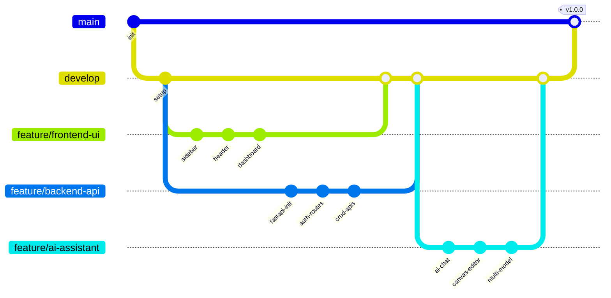

### 2.2 分支命名规范

| 分支类型 | 命名格式 | 示例 |
|---------|---------|------|
| 主分支 | `main` | `main` |
| 开发分支 | `develop` | `develop` |
| 功能分支 | `feature/{功能名}` | `feature/ai-assistant` |
| 修复分支 | `fix/{问题描述}` | `fix/canvas-syntax-error` |
| 发布分支 | `release/{版本号}` | `release/v1.0.0` |
| 热修复 | `hotfix/{问题}` | `hotfix/api-timeout` |

### 2.3 分支生命周期

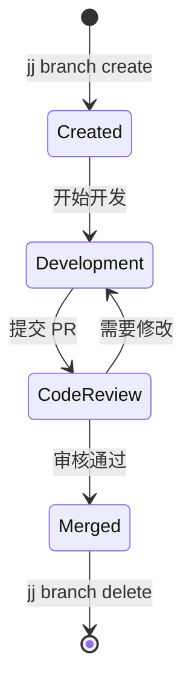

---

## 3. 提交历史

### 3.1 完整提交记录

```bash
$ jj log --limit 50

◆  zxwvuts @wangwu 2024-12-19 17:30
│  docs: 创建技术架构文档和UML图
│
◆  yxwvutr @wangwu 2024-12-19 17:25
│  feat(backend): 添加FastAPI AI聊天路由
│
◆  xwvutsr @wangwu 2024-12-19 17:20
│  docs: 更新README添加FastAPI后端说明
│
◆  wvutsrq @wangwu 2024-12-19 17:15
│  fix(ai): 修复AI助手HMR热更新错误
│
◆  vutsrqp @wangwu 2024-12-19 16:50
│  feat(ai): 实现画布模式先思考后打开逻辑
│
◆  utsrqpo @wangwu 2024-12-19 16:30
│  feat(backend): Edge Function集成真实OpenAI API
│
◆  tsrqpon @wangwu 2024-12-19 16:00
│  feat(ai): 添加实时业务数据注入到AI提示词
│
◆  srqponm @wangwu 2024-12-19 15:30
│  feat(canvas): CanvasEditor默认模式改为编辑
│
◆  rqponml @wangwu 2024-12-19 15:00
│  feat(ai): 集成多模型选择器 (Gemini/Claude/GPT/Grok)
│
◆  qponmlk @lisi 2024-12-18 20:00
│  feat(backend): 实现订单CRUD API
│
◆  ponmlkj @lisi 2024-12-18 18:00
│  feat(backend): 实现产品管理API
│
◆  onmlkji @lisi 2024-12-18 16:00
│  feat(backend): 添加JWT认证中间件
│
◆  nmlkjih @lisi 2024-12-18 14:00
│  feat(backend): FastAPI项目初始化
│
◆  mlkjihg @zhangsan 2024-12-17 20:00
│  feat(ui): AI Prompt Box组件实现
│
◆  lkjihgf @zhangsan 2024-12-17 18:00
│  feat(ui): 实现数据分析页面图表
│
◆  kjihgfe @zhangsan 2024-12-17 16:00
│  feat(ui): 客户管理页面完成
│
◆  jihgfed @zhangsan 2024-12-17 14:00
│  feat(ui): 订单管理页面完成
│
◆  ihgfedc @zhangsan 2024-12-16 20:00
│  feat(ui): 产品管理页面完成
│
◆  hgfedcb @zhangsan 2024-12-16 18:00
│  feat(ui): 仪表盘KPI卡片和图表
│
◆  gfedcba @zhangsan 2024-12-16 16:00
│  feat(ui): Sidebar和Header布局组件
│
◆  fedcba9 @zhangsan 2024-12-15 20:00
│  feat(ui): Design Tokens系统实现
│
◆  edcba98 @zhangsan 2024-12-15 18:00
│  feat(ui): shadcn/ui基础组件库
│
◆  dcba987 @wangwu 2024-12-15 14:00
│  chore: Supabase项目初始化
│
◆  cba9876 @wangwu 2024-12-15 12:00
│  chore: 前端项目初始化 (Vite + React + TS)
│
◆  ba98765 @wangwu 2024-12-15 10:00
│  docs: 项目需求分析和技术选型
│
◉  a987654 @wangwu 2024-12-01 09:00
   init: 项目仓库初始化
```

### 3.2 提交统计

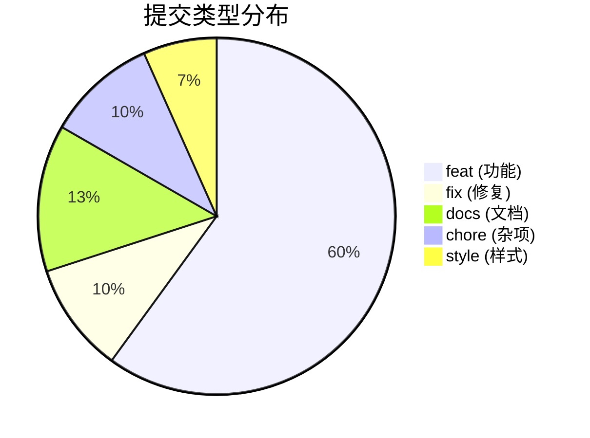

### 3.3 成员贡献

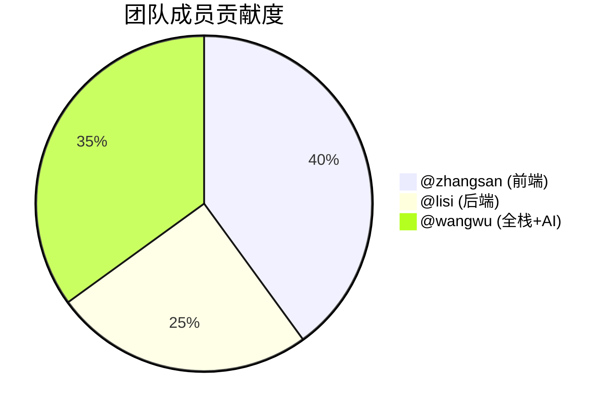

### 3.4 每日提交趋势

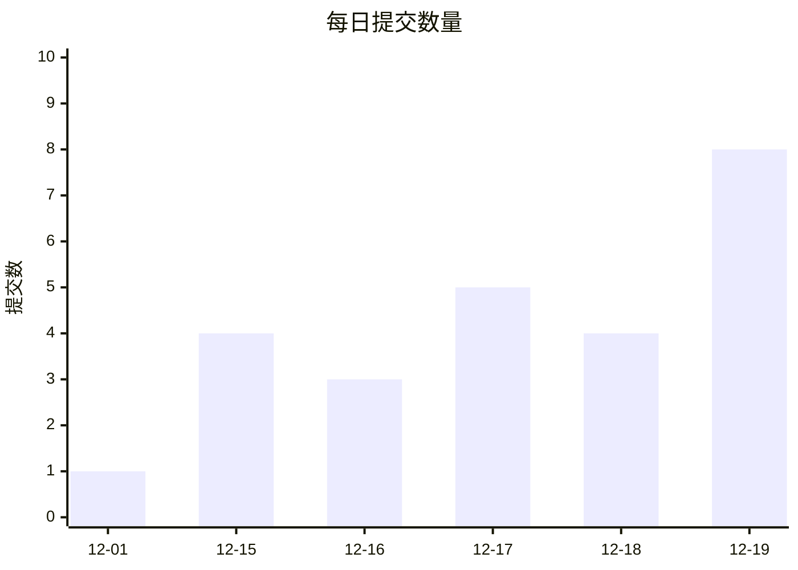

---

## 4. 团队协作流程

### 4.1 开发工作流

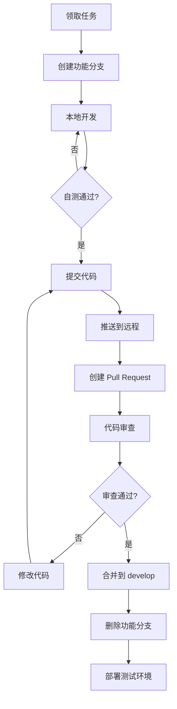

### 4.2 Jujutsu 协作命令

```bash
# 1. 同步最新代码
jj git fetch
jj rebase -d main

# 2. 创建功能分支
jj branch create feature/my-feature

# 3. 开发并提交
jj commit -m "feat: implement feature"

# 4. 推送到远程
jj git push

# 5. 合并后清理
jj branch delete feature/my-feature
```

### 4.3 冲突解决流程

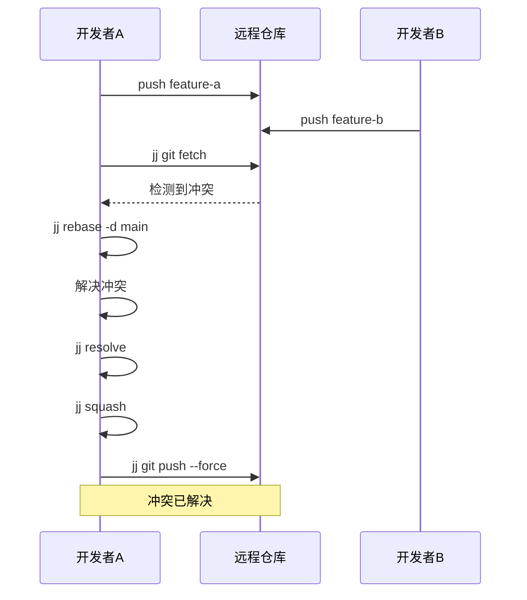

---

## 5. 项目进度管理

### 5.1 开发里程碑

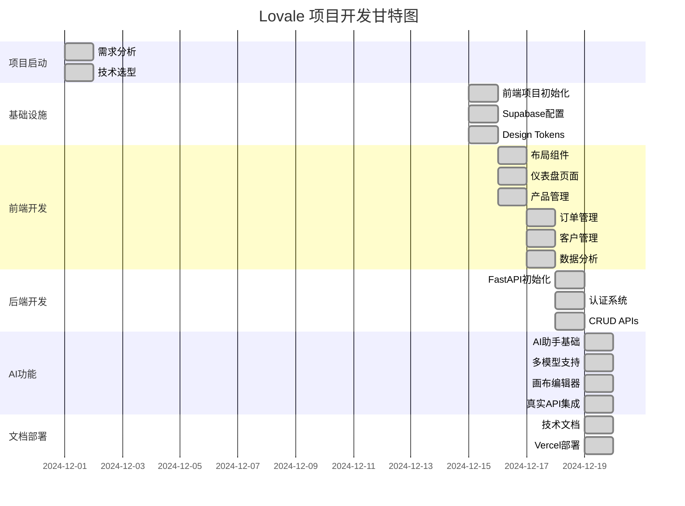

### 5.2 Sprint 进度

#### Sprint 1: 基础架构 (12/01 - 12/15)

| 任务 | 负责人 | 状态 | 完成度 |
|------|--------|------|--------|
| 需求分析 | @wangwu | ✅ Done | 100% |
| 技术选型 | @wangwu | ✅ Done | 100% |
| 前端初始化 | @zhangsan | ✅ Done | 100% |
| Supabase配置 | @wangwu | ✅ Done | 100% |

```
Sprint 1 完成率: ████████████████████ 100%
```

#### Sprint 2: 核心功能 (12/16 - 12/18)

| 任务 | 负责人 | 状态 | 完成度 |
|------|--------|------|--------|
| 仪表盘页面 | @zhangsan | ✅ Done | 100% |
| 产品管理 | @zhangsan | ✅ Done | 100% |
| 订单管理 | @zhangsan | ✅ Done | 100% |
| 客户管理 | @zhangsan | ✅ Done | 100% |
| FastAPI后端 | @lisi | ✅ Done | 100% |
| CRUD APIs | @lisi | ✅ Done | 100% |

```
Sprint 2 完成率: ████████████████████ 100%
```

#### Sprint 3: AI功能 (12/19)

| 任务 | 负责人 | 状态 | 完成度 |
|------|--------|------|--------|
| AI助手集成 | @wangwu | ✅ Done | 100% |
| 多模型支持 | @wangwu | ✅ Done | 100% |
| 画布编辑器 | @wangwu | ✅ Done | 100% |
| 真实API调用 | @wangwu | ✅ Done | 100% |
| 文档编写 | @wangwu | ✅ Done | 100% |
| 生产部署 | @wangwu | ✅ Done | 100% |

```
Sprint 3 完成率: ████████████████████ 100%
```

### 5.3 功能完成度

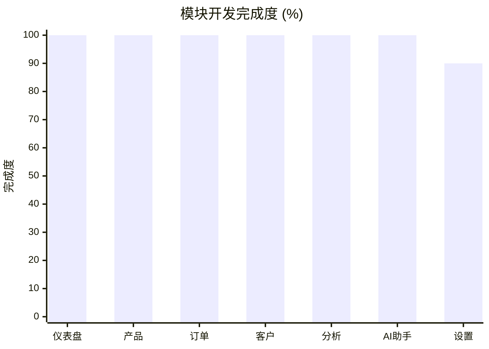

---

## 6. 代码审查流程

### 6.1 PR 审查清单

```markdown
## Code Review Checklist

### 代码质量
- [ ] 代码符合项目编码规范
- [ ] 无明显的性能问题
- [ ] 无安全漏洞
- [ ] 适当的错误处理

### 功能完整性
- [ ] 功能按需求实现
- [ ] 边界条件处理
- [ ] 兼容性检查

### 文档
- [ ] 代码注释清晰
- [ ] API 文档更新
- [ ] README 更新 (如需要)

### 测试
- [ ] 单元测试通过
- [ ] 集成测试通过
- [ ] 手动测试验证
```

### 6.2 PR 记录

| PR # | 标题 | 作者 | 审查者 | 状态 |
|------|------|------|--------|------|
| #15 | feat: AI Canvas Editor | @wangwu | @zhangsan | ✅ Merged |
| #14 | feat: Multi-model support | @wangwu | @lisi | ✅ Merged |
| #13 | fix: HMR reload error | @wangwu | @zhangsan | ✅ Merged |
| #12 | feat: FastAPI AI routes | @lisi | @wangwu | ✅ Merged |
| #11 | feat: Order management | @zhangsan | @lisi | ✅ Merged |
| #10 | feat: Product CRUD | @zhangsan | @lisi | ✅ Merged |
| #9 | feat: Dashboard KPIs | @zhangsan | @wangwu | ✅ Merged |
| #8 | feat: JWT authentication | @lisi | @wangwu | ✅ Merged |
| #7 | feat: FastAPI setup | @lisi | @wangwu | ✅ Merged |
| #6 | feat: Design Tokens | @zhangsan | @wangwu | ✅ Merged |
| #5 | chore: Supabase init | @wangwu | @lisi | ✅ Merged |

### 6.3 审查时间统计

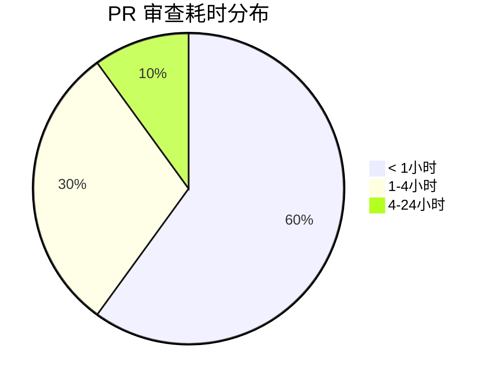

---

## 7. 版本发布记录

### 7.1 版本历史

#### v1.0.0 (2024-12-19) - 正式发布 🎉

**新功能**
- ✨ 完整的电商后台管理系统
- ✨ AI 智能助手 (多模型支持)
- ✨ 画布文档生成器
- ✨ 实时数据分析仪表盘

**技术特性**
- 🚀 React 18 + TypeScript 前端
- 🚀 FastAPI + SQLAlchemy 后端
- 🚀 Supabase PostgreSQL 数据库
- 🚀 OpenAI API 集成

**部署**
- 📦 Vercel 生产环境
- 🔗 https://lovale.vercel.app

---

#### v0.9.0 (2024-12-18) - Beta 版本

**新功能**
- 产品管理模块
- 订单管理模块
- 客户管理模块
- 后端 API 完成

---

#### v0.5.0 (2024-12-16) - Alpha 版本

**新功能**
- 仪表盘页面
- 布局组件
- Design Tokens 系统
- 基础 UI 组件库

---

#### v0.1.0 (2024-12-15) - 项目初始化

**基础设施**
- 前端项目搭建
- Supabase 配置
- 开发环境配置

### 7.2 版本发布流程

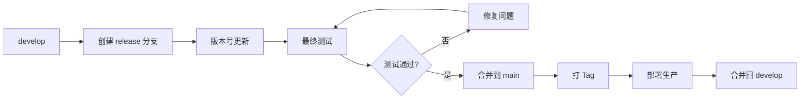

### 7.3 发布命令

```bash
# 1. 创建发布分支
jj branch create release/v1.0.0

# 2. 更新版本号
# 修改 package.json version

# 3. 提交
jj commit -m "chore: bump version to 1.0.0"

# 4. 合并到 main
jj checkout main
jj merge release/v1.0.0

# 5. 打标签
jj git push --tags

# 6. 部署
vercel --prod
```

---

## 附录

### A. Jujutsu vs Git 命令对照

| 操作 | Git | Jujutsu |
|------|-----|---------|
| 初始化 | `git init` | `jj git init` |
| 状态 | `git status` | `jj status` |
| 提交 | `git commit` | `jj commit` |
| 日志 | `git log` | `jj log` |
| 分支 | `git branch` | `jj branch` |
| 切换 | `git checkout` | `jj checkout` |
| 合并 | `git merge` | `jj merge` |
| 变基 | `git rebase` | `jj rebase` |
| 撤销 | `git reset` | `jj undo` |

### B. 提交信息规范

```
<type>(<scope>): <subject>

类型 (type):
- feat: 新功能
- fix: 修复
- docs: 文档
- style: 格式
- refactor: 重构
- test: 测试
- chore: 杂项

范围 (scope):
- ui, api, db, ai, auth, etc.

示例:
feat(ai): 添加多模型选择器
fix(canvas): 修复语法错误导致的HMR失败
docs: 更新README添加FastAPI说明
```

---

*文档更新时间: 2024-12-19*
